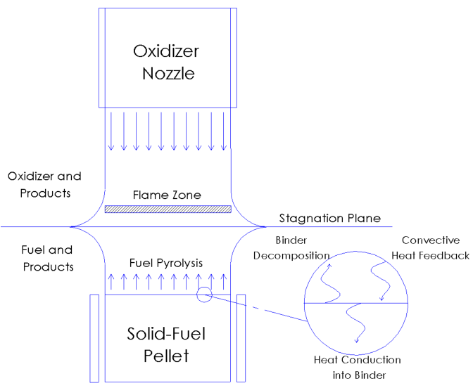
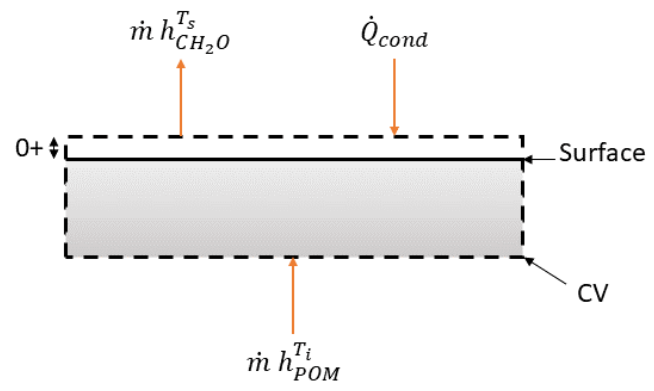

# Counterflow Polymer

A Cantera version of reproduction of the counterflow solid fuel regression rate calculation algorithm in "G. Talamantes, Characterization of polyoxymethylene as a high-density fuel for use in hybrid rocket applications, Ph.D. thesis, The Pennsylvania State University (2019).".

## Schematic



## Method

The regression rate, $r_b$, can be calculated by both energy conservation and continuity. The energy conservation gives:

```math
\dot{m}h_{\rm POM}^{T_i}-\dot{m}h_{\rm CH_2O}^{T_S}+\dot{Q}_{\rm cond}=0,
```

where $T_i$ is the inlet solid POM temperature, and $T_S$ is the outlet gas phase CH<sub>2</sub>O temperature. The regression rate can be obtained from the mass flow rate as

```math
\begin{equation}
r_b=\frac{\dot{m}}{\rho_{\rm solid}}=\frac{\dot{Q}_{\rm cond}}{\Delta h\rho_{\rm solid}}=\frac{k_{\rm gas}\left.\frac{\partial T}{\partial x}\right|_{x=0}}{(h_{\rm POM}^{T_i}-h_{\rm CH_2O}^{T_S})\rho_{\rm solid}}.
\end{equation}
```

The regression rate can also be calculated from continuity.

```math
\tag{2}
\tilde{r_b}=\frac{\rho_{\rm gas}v_f}{\rho_{\rm solid}},
```

where $v_f$ is the gas phase fuel inlet velocity.

Required boundary conditions to solve the counterflow problem are
- Oxidizer inlet component: provided. Pure oxygen for example.
- Oxidizer inlet temperature: provided. 298K for example.
- Oxidizer inlet velocity: provided.
- Fuel inlet component: provided. Pure POM.
- Fuel inlet temperature: provided. 700K for example. The regression rate is found to be insensitive to it under heat transfer dominating assumption.
- Fuel inlet velocity: Unknown.

Fuel inlet velocity is the only unknown boundary condition. So, the algorithm first guess a fuel inlet velocity, for example, the same as the oxidizer inlet velocity. Cantera CounterflowDiffusionFlame is then used to solve the counterflow problem. The solution provides gas phase density at the fuel side boundary, which allows us to calculated the regression rate from Eq. (2). It also provides the gas phase thermal conductivity and the temperature gradient at the fuel side boundary, which give the conductive heat flux. Then the regression rate can be calculated by Eq. (1). The goal is to find a fuel inlet velocity to match these two regression rates. We iterate until the difference between two regression rates is less than a given tolerence, $10^{-9}$ m/s for example. At each iteration the fuel inlet velocity is updated as

```math
v_{f,\rm new}=v_{f,\rm old}\frac{\tilde{r_b}+s(r_b-\tilde{r_b})}{\tilde{r_b}},
```

where $s$ is the scaling factor to assure convergence. $s=0.3$ for example.

## Example

Sample code is in the jupyter notebook file, "example/counterflow.ipynb". It reproduces Fig. 26 of the original thesis using Cantera CounterflowDiffusionFlame.
